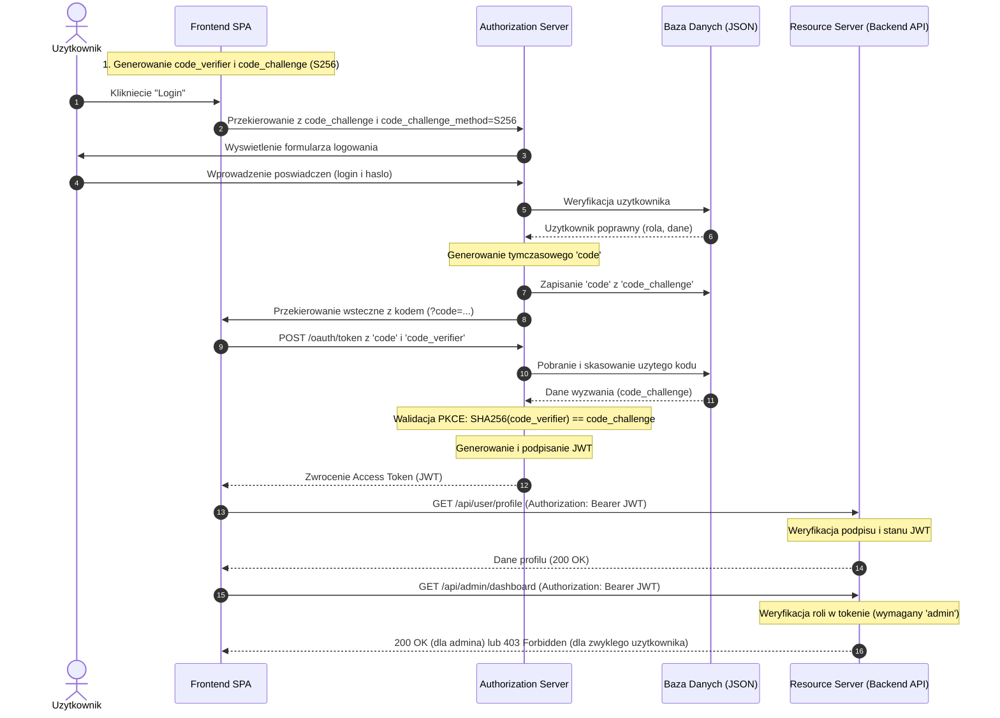

# Aplikacja Zabezpieczona OAuth 2.0 z PKCE

Projekt demonstracyjny zawierający kompletny przepływ OAuth 2.0 (Authorization Code Flow) z mechanizmem PKCE (Proof Key for Code Exchange) oraz kontrolą dostępu opartą na rolach (RBAC).

**Autor:** Olivier Otta  
**Grupa:** Grupa 2

---

## Komponenty Aplikacji
1. **Frontend (SPA):** Serwowany z katalogu `public/`, napisany w czystym HTML i Vanilla JS, prezentujący interaktywny panel użytkownika z wizualizacją kroków PKCE.
2. **Backend (Resource Server):** Zabezpieczony tokenami JWT (weryfikacja podpisu w nagłówku `Authorization: Bearer <token>`).
3. **Authorization Server:** Odpowiedzialny za logowanie użytkowników, generowanie kodów autoryzacyjnych, walidację PKCE i wystawianie tokenów JWT.
4. **Baza Danych (JSON-based):** Prosty, lekki i przenośny plik `db.json` przechowujący zarejestrowanych klientów OAuth, użytkowników (wraz z rolami) oraz tymczasowe kody autoryzacyjne.

---

## Instrukcja Uruchomienia

Aplikacja jest w pełni zintegrowana w jednym procesie Node.js, co pozwala na jej uruchomienie pojedynczym poleceniem.

### Wymagania
* Node.js (w wersji v18+)
* npm

### Uruchomienie
1. Otwórz terminal w folderze projektu.
2. Zainstaluj wymagane paczki:
   ```bash
   npm install
   ```
3. Uruchom serwer aplikacji:
   ```bash
   npm start
   ```
4. Aplikacja będzie dostępna w przeglądarce pod adresem:
   **[http://localhost:3000](http://localhost:3000)**

---

## Dane Testowe do Logowania

W bazie danych (`db.json`) przygotowano dwa konta o różnych poziomach uprawnień:

| Rola | Nazwa użytkownika (Username) | Hasło (Password) | Dostępne endpointy |
| :--- | :--- | :--- | :--- |
| **Zwykły Użytkownik** | `user` | `user123` | `/health`, `/profile`, `/settings`, `/data` |
| **Administrator** | `admin` | `admin123` | Wszystkie (w tym `/admin/dashboard`) |

---

## Zabezpieczone Endpointy (Backend API)

Serwer udostępnia następujące ścieżki (zgodnie z wymaganiami):

1. **`GET /api/health`** — **Niezabezpieczony** endpoint sprawdzający stan działania serwera (health check).
2. **`GET /api/user/profile`** — **Zabezpieczony** (wymaga poprawnego tokenu JWT). Zwraca dane profilowe zalogowanego użytkownika.
3. **`GET /api/user/settings`** — **Zabezpieczony** (wymaga tokenu JWT). Zwraca przykładowe ustawienia użytkownika.
4. **`GET /api/data`** — **Zabezpieczony** (wymaga tokenu JWT). Zwraca chronione dane biznesowe.
5. **`GET /api/admin/dashboard`** — **Zabezpieczony + Rola (Admin)**. Dostępny tylko dla użytkowników posiadających rolę `admin` zapisaną w tokenie JWT.

---

## Jak Działa PKCE? (Wyjaśnienie do Obrony)

**PKCE** (Proof Key for Code Exchange, RFC 7636) to rozszerzenie standardowego przepływu kodu autoryzacyjnego OAuth 2.0. Zapobiega ono atakom typu **authorization code interception** na klientach publicznych (np. aplikacje typu SPA lub aplikacje mobilne), które nie mogą bezpiecznie przechowywać sekretu klienta (`client_secret`).

### Kroki przepływu:
1. **Generowanie kluczy (Klient):** 
   Przed przekierowaniem, frontend generuje kryptograficznie silny, losowy ciąg znaków nazywany `code_verifier`. Następnie tworzy jego skrót przy użyciu algorytmu SHA-256 i koduje go metodą Base64URL, uzyskując `code_challenge`.
2. **Żądanie Autoryzacji (Klient -> Serwer Autoryzacji):**
   Klient przekierowuje użytkownika do logowania, dołączając do adresu URL parametry `code_challenge` oraz `code_challenge_method=S256`. Serwer autoryzacji zapisuje to wyzwanie w swojej bazie danych.
3. **Uwierzytelnienie i przekierowanie powrotne:**
   Użytkownik loguje się. Serwer generuje tymczasowy kod autoryzacyjny (`code`) i przekierowuje użytkownika z powrotem do aplikacji frontendowej, dołączając ten kod w adresie URL.
4. **Wymiana Kodu na Token (Klient -> Serwer Autoryzacji):**
   Frontend wyciąga `code` z adresu URL i wysyła zapytanie typu POST na endpoint `/oauth/token`. Przesyła w nim odebrany `code` oraz **oryginalny** `code_verifier` (zapisany w pamięci sesji przeglądarki).
5. **Walidacja PKCE (Serwer Autoryzacji):**
   Serwer pobiera zapisane wyzwanie powiązane z tym kodem, haszuje otrzymany `code_verifier` za pomocą SHA-256 i porównuje wynik z zapisanym wcześniej `code_challenge`. Jeśli wartości są identyczne, serwer wydaje token dostępowy JWT.

### Dlaczego to jest bezpieczne?
Nawet jeśli złośliwa aplikacja lub atakujący przechwyci tymczasowy kod autoryzacyjny (np. z historii przeglądarki lub logów sieciowych), **nie będzie w stanie wymienić go na token**, ponieważ nie posiada oryginalnego `code_verifier`, którego poprawność serwer sprawdza przy wymianie.

---

## Opis Funkcjonalności Systemu

System implementuje bezpieczną autoryzację i autentykację użytkowników opartą na tokenach JWT w architekturze OAuth 2.0 z rozszerzeniem PKCE. Główne funkcjonalności obejmują:
1. **Logowanie z PKCE:** Użytkownik loguje się przez dedykowany ekran logowania serwera autoryzacji. System w tle weryfikuje poprawność hasła i zabezpiecza proces przed przechwyceniem kodu (PKCE Verification).
2. **Bezpieczne API (Resource Server):** Wszystkie kluczowe endpointy backendu są chronione i wymagają przesłania tokenu JWT w nagłówku `Authorization: Bearer <token>`.
3. **Podział ról i uprawnień (RBAC):** Użytkownicy posiadają role przypisane w bazie danych (np. `user`, `admin`). Rola jest zaszyta w tokenie JWT i weryfikowana na backendzie przy próbie dostępu do zablokowanych zasobów (np. panel administratora `/api/admin/dashboard`).
4. **Niezabezpieczony monitor stanu:** Ścieżka `/api/health` pozwala sprawdzić status działania aplikacji bez konieczności logowania.
5. **Dynamiczny wizualizator przepływu:** Frontend w czasie rzeczywistym podświetla, na jakim etapie autoryzacji znajduje się aplikacja (generowanie kluczy -> logowanie -> odebranie kodu -> wymiana na token -> żądanie API).
6. **Podgląd kryptograficzny:** Panel programistyczny prezentuje w locie wygenerowany `code_verifier`, `code_challenge` oraz zdekodowaną zawartość tokenu JWT (nagłówek i ładunek).

---

## Diagram Komunikacji w Systemie


